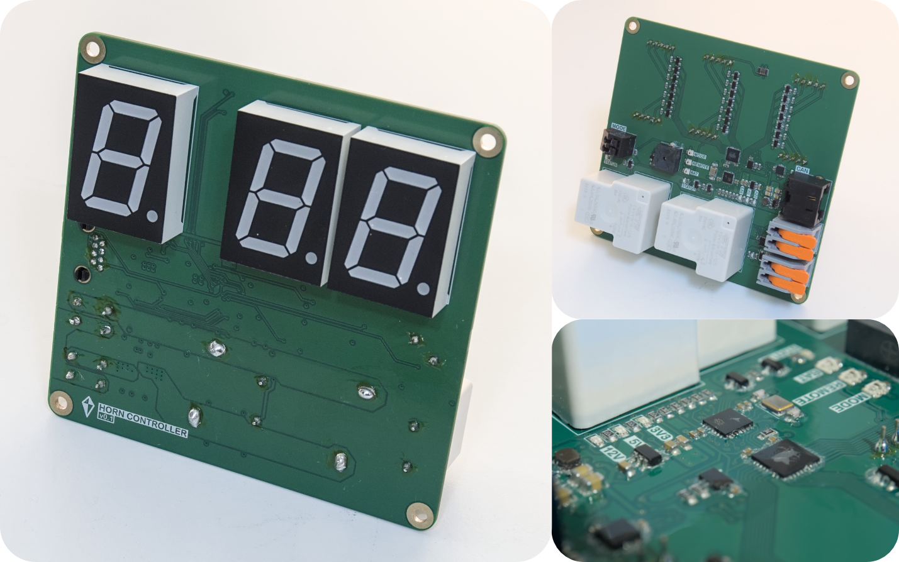

# Horn Controller v0.1

Controller board for signal horns on a sailing race course and designed for reliability and easy integration. The board includes features such as ...

* __Current-sensing__: Current sensor at output of relays for making sure that motor is connected and running
* __Multiple Relays__: Two relays combined with logic to account for one of the relays failing
* __Large Display__: Large seven segment displays making it easy to see the countdown from a distance
* __Wago Connectors__: Easy to conect the power and motor wires, without the need to crimp on any connectors
* __CAN Bus__: Reliable and flexible communication with a remote control

## Resources
[Schematic](Schematic.pdf)
